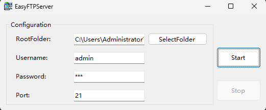

# EasyFTPServer

- The easiest FTP server on windows.
- Download and use instantly, no installation or complex configuration required.
- Supports username and password configuration, and allows custom directory selection.
- Available in eight languages.

## Requirements
- Windows 10 or newer
- [.Net 8.0 Runtime](https://dotnet.microsoft.com/en-us/download/dotnet/8.0 ".Net 8.0 Runtime")

## Compilation
- C# .Net 8.0
- Visual Studio 2022

## Usage
- Download the latest file and run
- Select the root folder of ftp
- Configure username and password (or not)
- Click the start button

**If you want to connect to this FTP server from another computer, follow these steps:**
- Use the command line to view the IP address (cmd -> ipconfig)
- Open the Explorer on another computer
- Enter the FTP server address in the explorer: ftp://FTP_SERVER_IP:21/

> Can't stand the slow download speed of Windows RDP? 
No convenient way to transfer files within the internal network? 
Tired of complicated FTP server configurations? 
Give this software a try! 
